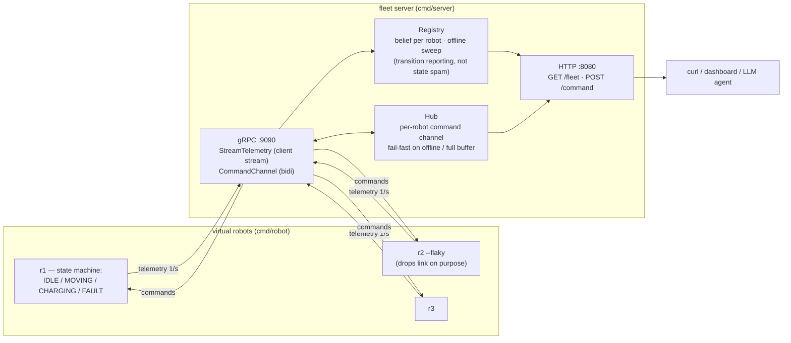

# fleet-lite

A minimal robot-fleet control server in Go + gRPC: N virtual robots stream telemetry to a central server, the server judges liveness and pushes commands back, and a tiny HTTP API exposes fleet state to humans and agents.

Built as a deliberate counterpart to [daijin](https://github.com/nonasking/daijin), which solves the same device↔cloud problem over MQTT — see [MQTT vs gRPC](#mqtt-daijin-vs-grpc-fleet-lite) below.

## Architecture



## Quickstart

```bash
go run ./cmd/server &                  # gRPC :9090, HTTP :8080
go run ./cmd/robot --id r1 &
go run ./cmd/robot --id r2 --flaky &   # exercises offline/recovery on its own
go run ./cmd/robot --id r3 &

curl -s localhost:8080/fleet | python3 -m json.tool
curl -s -X POST localhost:8080/command -d '{"RobotID":"r1","Verb":"goto","Arg":"5,5"}'
```

Watch the server log: robots come online (🟢), acks flow back (✅), and when a robot dies or `--flaky` drops its link, the sweep marks it offline (🔴) within the timeout and the reconnect brings it back with exponential backoff.

Command verbs: `goto x,y` · `stop` · `charge` · `fault` (inject) · `clear_fault`.

## Design decisions

- **Transitions, not states.** The registry reports *changes* (came online, went offline) exactly once; steady heartbeats are silent. Alert spam is the fastest way to make an operator ignore a control tower.
- **The server owns liveness.** A robot is offline when the server hasn't heard from it within the timeout — judged by a periodic sweep, so the answer is the same whether the robot crashed, lost network, or hung. (In the MQTT design this job belongs to the broker's LWT; here there is no broker, so the judgment moves into the registry.)
- **Failure is visible at the call site.** Commanding an offline robot fails immediately with a reason (`409`), and a full per-robot buffer refuses new commands rather than queueing unboundedly. No fire-and-forget.
- **Reconnect is the robot's default behavior.** Streams *will* drop; the client reconnects with exponential backoff (reset after a healthy session) and re-announces itself. A reconnect replaces a zombie stream server-side.
- **Transport and model are separated.** `internal/fleet` (registry, hub) has no gRPC imports and is covered by table-driven tests; the gRPC layer is a thin adapter. Tests run with no network.

## MQTT (daijin) vs gRPC (fleet-lite)

Same problem — devices on unreliable networks, a brain in the middle — solved with both major transports:

| | MQTT (daijin) | gRPC (fleet-lite) |
|---|---|---|
| Topology | broker in the middle; both sides dial out (NAT-friendly, device can be anywhere) | direct connection; server must be reachable from robots |
| Schema | none — topic names + hand-rolled byte headers (`[clipId][seq:2][flags]`) | protobuf, typed and versioned; drift fails at compile time |
| Liveness | broker LWT marks the retained status on disconnect | server-side sweep over last-seen timestamps |
| Delivery | QoS knob per message (we chose QoS0 for audio: latency > completeness) | per-stream ordering + backpressure built in; failures surface as stream errors |
| Command → result | publish, then subscribe to an ack topic and correlate by hand | request flows on the same stream; correlation by `command_id` |
| Where it shines | far-flung devices, tiny firmware clients, fan-out | structured control plane inside an infrastructure boundary |

Practical conclusion: for daijin's portable speaker on LTE, the broker rendezvous is the right call; for a factory fleet behind one network boundary, the typed bidirectional stream is. A real system often uses both — MQTT at the edge, gRPC between services.

## What this deliberately does not do

- No path planning, no collision avoidance, no maps — `goto` moves a point in a straight line.
- No real robots, no ROS. The simulator exists to exercise *fleet* behavior (disconnects, recovery, command routing), not robot behavior.
- No persistence, no auth, no TLS. In-memory state, localhost trust.

## Layout

```
proto/fleet.proto        wire contract (the design doc — read this first)
gen/fleetpb/             generated code (committed; protoc not needed to build)
internal/fleet/          registry (liveness) + hub (command routing) — pure logic, table-driven tests
cmd/server/              gRPC ingress + HTTP panel + offline sweep
cmd/robot/               virtual robot: state machine, reconnect/backoff, --flaky
```

Regenerate after editing the proto:

```bash
protoc --go_out=gen --go_opt=paths=source_relative \
       --go-grpc_out=gen --go-grpc_opt=paths=source_relative \
       --proto_path=proto proto/fleet.proto && mv gen/*.pb.go gen/fleetpb/
```

---
*Built with [Claude Code](https://claude.com/claude-code).*
